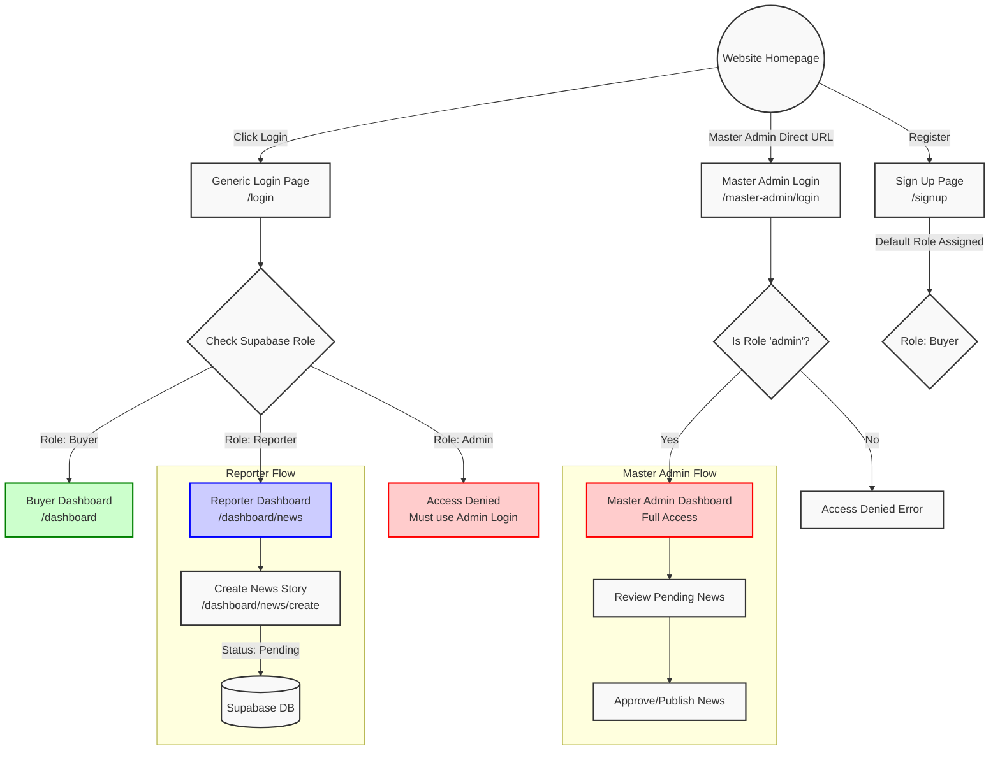

# Kabutar Media Agency - Platform Guide 🕊️

આ માર્ગદર્શિકા (Guide File) **Kabutar Media Agency** ના તમામ URLs, રોલ્સ (Roles), અને લોગિન પ્રોસેસ કેવી રીતે કામ કરે છે તેની વિગતવાર માહિતી આપે છે. જ્યારે પણ પ્લેટફોર્મની અંદર નવા ફેરફારો થશે, ત્યારે આ ફાઈલ અપડેટ કરવામાં આવશે.

---

## 🔗 Platform URLs 

| વાતાવરણ (Environment) | લિંક (URL) |
| :--- | :--- |
| **Local Development** | [http://localhost:3000](http://localhost:3000) |
| **Live Vercel (Production)** | [https://kabutarmedia.vercel.app](https://kabutarmedia.vercel.app) |

---

## 👥 User Roles & Login URLs (યુઝર રોલ્સ અને લોગિન)

સિસ્ટમમાં મુખ્યત્વે **3 પ્રકારના Roles** બનાવવામાં આવ્યા છે:

### 1. Master Admin (માસ્ટર એડમિન)
આ રોલ પ્લેટફોર્મના માલિક માટે છે, જેઓ બધી સિસ્ટમ મેનેજ કરી શકે છે.
* **લોગિન URL:** `/master-admin/login`
* **સ્થિતિ (Status):** માસ્ટર એડમિન એકાઉન્ટ ડેટાબેઝમાંથી ડિફોલ્ટ બનાવેલ છે (નવું સાઈન-અપ થઈ શકે નહિ).
* **Login Details:**
  * **Email:** `directoratulpatoliya@gmail.com`
  * **Password:** `At@9726530209`

### 2. Reporter (રિપોર્ટર)
આ રોલ એવા પત્રકારો માટે છે જેઓ પોતાની News Story સબમિટ (Submit) કરે છે અને પૈસા કમાય છે.
* **લોગિન URL:** `/login`
* **નોંધણી URL (Sign Up):** `/signup` 
* **કાર્ય:** "My News" ડેશબોર્ડ જોઈ શકે છે અને નવી સ્ટોરી અપલોડ કરી શકે છે.

### 3. Buyer (ખરીદનાર / પબ્લિશર)
આ રોલ ન્યૂઝ એજન્સીઓ કે પબ્લિશર માટે છે કે જેઓ રિપોર્ટરની સ્ટોરી ખરીદે છે. (નવા સાઈન-અપ પર ડિફોલ્ટ રોલ `buyer` હોય છે.)
* **લોગિન URL:** `/login`
* **નોંધણી URL (Sign Up):** `/signup`
* **કાર્ય:** માર્કેટપ્લેસમાંથી સ્ટોરી ખરીદે છે અને પેમેન્ટ કરે છે. 

---

## 🔄 Authentication Flow & User Journey (ફ્લો ડાયાગ્રામ)

યુઝર્સ સિસ્ટમમાં કેવી રીતે જોડાય છે અને કયા પેજ પર જાય છે તેની આકૃતિ નીચે મુજબ છે:

---

## 🛠️ માસ્ટર એડમિન માટેની અગત્યની નોંધ (Guidelines)
- **Supabase Auth:** જો નવી ઈમેલ એડ્રેસથી એડમિન બનાવવો હોય, તો ડેટાબેઝના `public.users` ટેબલમાં જઈને `role` ને `buyer` માંથી `admin` કરવો પડશે. 
- **Security:** રિપોર્ટર અથવા બાયર ક્યારેય `/master-admin/login` પરથી લોગિન નહિ કરી શકે, ભલે તેમને સાચો પાસવર્ડ ખબર હોય. 

આ ફાઈલમાં પ્રોજેક્ટના બધા મેઈન ફ્લો (Flow) આપેલા છે. ભવિષ્યમાં જ્યારે પણ નવા રોલ્સ કે પેજ બનશે, ત્યારે હું આ ગાઈડ ફાઈલને આપોઆપ અપડેટ કરી આપીશ!
